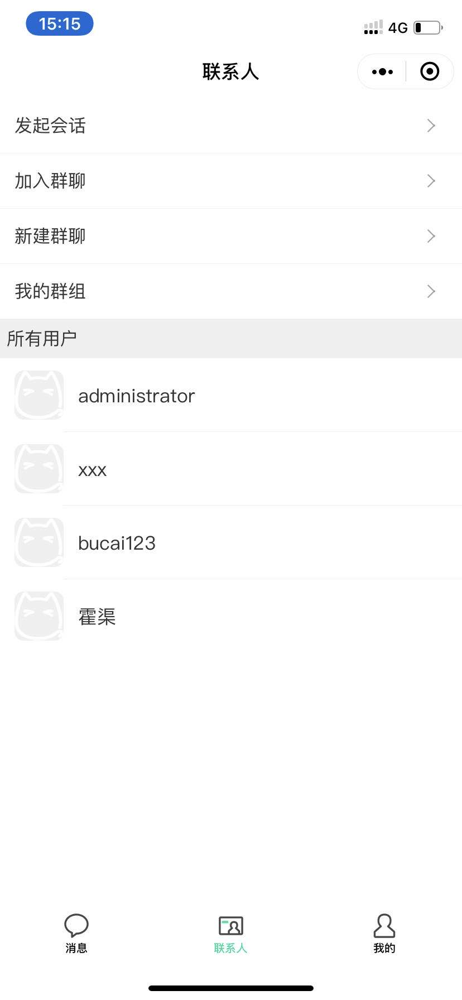
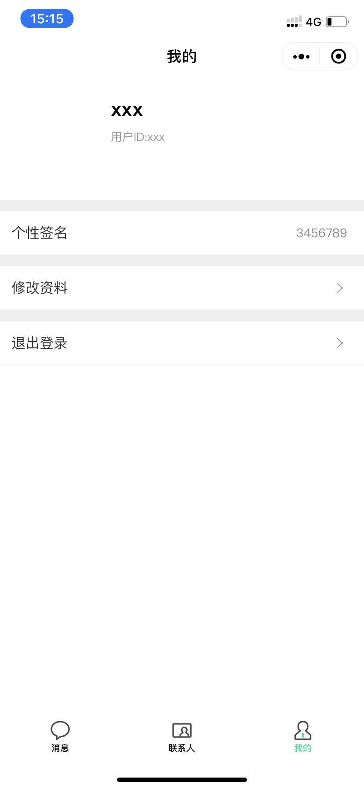

# 才聊

一个为了弥补某一个知识空缺而产生的东西

> 由 Tarojs 开发

## 展示图片（丑是有点，但是问题不大）






## 体验地址

### h5地址

[https://im.notbucai.com/h5/](https://im.notbucai.com/h5/)


### 微信小程序 （`麻烦申请一下体验，我这边看到就通过`）


## 如何使用？

1. npm install 安装服务端和taro端依赖

2. 将 /server/index.config.tml.js 改为 index.config.js 并填入相关字段

```
sdkappid: "", // timsdk sdkappid
key: "" // tim server key
```

3. 在 /src/config 下新增 `production.config.ts` 文件 
```
export default {
  baseURL: 接口地址,
  SDKAppID: timsdk appid
}
```

4. 运行 服务端 
```
node app.js
```

4. 运行 taro 
```
npm run dev:*  // * 具体代表请看package or taro doc
```